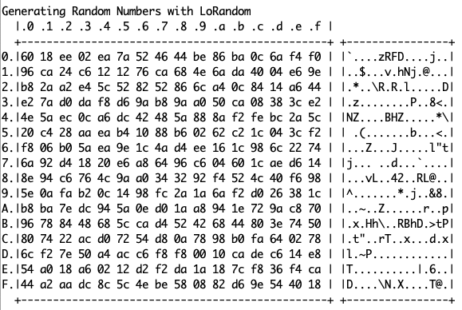
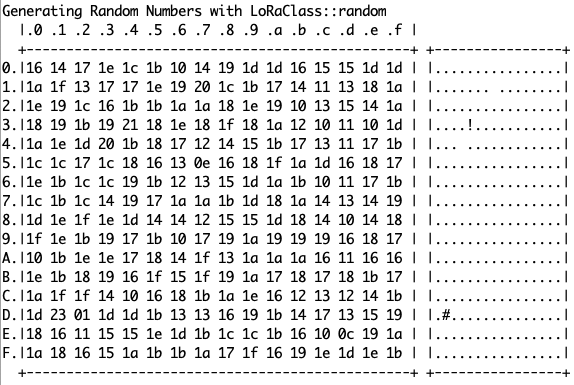

# ESP32 Random Test

A sample sketch demonstrating the problem in Sandeep Mistry's excellent LoRa library's `random()` function. See [this issue](https://github.com/sandeepmistry/arduino-LoRa/issues/394) for context.

This was written for ESP32, but is easily adaptable to other platforms. The code runs on TTGO series. A T-Beam in this case, but it'll work as is with basically any LoRa-equipped TTGO or Heltec ESP32 device.

This version moves LoRandom to a [library on its own](https://github.com/Kongduino/LoRandom). I can now update one file and reuse in all my projects...

Note: I have "customized the LoRa library by moving
```c
  uint8_t readRegister(uint8_t address);
  void writeRegister(uint8_t address, uint8_t value);
```
to `public:` in LoRa.h – as we need access to the registers, obviously.

See:



vs


